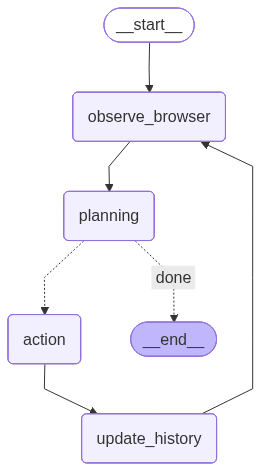

# Browser Agent with LangGraph

A **production-ready** browser automation agent built with LangGraph, demonstrating autonomous web navigation with LLM decision-making and modern web support.

## 🎯 What is This?

A LangGraph-based browser agent that autonomously navigates websites, interacts with elements, and completes complex tasks using LLM decision-making. Built with:

- **State Graph Architecture** - Clean node-based execution flow
- **Native Tool Calling** - LangGraph `@tool` decorator for actions
- **Rich Feedback** - Navigation detection, action results
- **Automatic State Management** - No manual tracking needed
- **Vision Support** - Screenshots sent to LLM for better perception

### Key Features

✅ **Modern Web Support** - Shadow DOM traversal, dynamic content  
✅ **8 Browser Tools** - Navigate, click, input, extract, scroll, keys, screenshot, done  
✅ **History Tracking** - Structured memory of actions and results  
✅ **Graph Visualization** - Built-in flow visualization  

---

## 📦 Quick Start

### Installation

```bash
# From project root
cd agent_demo
source venv/bin/activate

# Install dependencies
pip install -r requirements.txt

# Configure API credentials
cp env.example .env
# Edit .env and add your Azure OpenAI credentials
```

### Run the Demo

```bash
# Demo will automatically load credentials from .env
python3 simple_browser_agent/demo_costco.py
```

**Expected Output:**
```
🚀 Starting LangGraph Browser Agent
Task: Complete Costco grocery shopping

Step 1/50: navigate → ✅ Navigated to https://www.costco.com
Step 2/50: input_text → ✅ Typed 'paper towels' into search box
Step 3/50: send_keys → ✅ Sent keys: Enter
Step 4/50: scroll → ✅ Scrolled down (100 elements found!)
Step 5/50: click → ✅ Clicked element 42 → Page navigated
...
```

---

## 🏗️ Architecture

### High-Level: Agent-Environment Interaction

The browser agent follows a classic **agent-environment loop** where the agent interacts with a web browser environment:

```
┌─────────────────────────────────────────────────────────────┐
│                    AGENT-ENVIRONMENT LOOP                    │
└─────────────────────────────────────────────────────────────┘

    ┌──────────────┐                      ┌──────────────┐
    │    AGENT     │                      │ ENVIRONMENT  │
    │   (LLM +     │                      │  (Browser)   │
    │  LangGraph)  │                      │              │
    └──────┬───────┘                      └──────▲───────┘
           │                                     │
           │ 1. Observe                          │
           │    - Screenshot                     │
           │    - URL, Title                     │
           │    - Interactive Elements           │
           │────────────────────────────────────►│
           │                                     │
           │ 2. Plan                              │
           │    - LLM analyzes state             │
           │    - Decides next action            │
           │    (e.g., "click element 5")        │
           │                                     │
           │ 3. Act                               │
           │    - Execute action                 │
           │────────────────────────────────────►│
           │                                     │
           │ 4. Observe Effects                   │
           │    - Page changed?                  │
           │    - New elements?                  │
           │◄────────────────────────────────────│
           │                                     │
           └─────────────► Loop until done
```

**Key Components:**

**🤖 Agent (LangGraph + LLM):**
- **Perceives:** Browser state (visual + textual)
- **Thinks:** Plans next action using LLM reasoning
- **Acts:** Executes browser actions (click, type, navigate)
- **Maintains State:** Tracks history of actions and results as internal context

**🌐 Environment (Browser):**
- **State:** Current webpage (URL, content, elements)
- **Dynamics:** Changes when agent takes actions
- **Observations:** Provides feedback (screenshots, element lists)

**🔄 Interaction Cycle:**
1. Agent observes browser state
2. Agent plans next action based on task goal
3. Agent executes action in browser
4. Browser state changes
5. Loop repeats until task complete

---

### LangGraph Implementation



### Components

**1. State (`BrowserAgentState` TypedDict)**
- `messages` - LangGraph message history (tool calling protocol)
- `current_url`, `current_title`, `elements`, `screenshot` - Browser observations
- `task`, `memory`, `step_number`, `history_items` - Agent internal state
- `is_done` - Completion flag

**2. Graph Nodes**
- `observe_browser` - Captures browser state (screenshot + elements)
- `planning` - LLM plans next action via tool calling
- `action` - Executes browser action (LangGraph ToolNode)
- `update_history` - Records action results

**3. Actions (8 Browser Tools)**
1. `navigate(url)` - Go to URLs
2. `click(index)` - Click with navigation detection
3. `input_text(index, text)` - Type into fields
4. `extract(query)` - LLM-powered info extraction
5. `send_keys(keys)` - Keyboard events (Enter, Tab, etc.)
6. `scroll(down, pages)` - Scroll pages
7. `screenshot()` - Capture screenshots
8. `done(result, success)` - Complete task

---

## 📚 Files & Structure

```
simple_browser_agent/
├── agent.py           # LangGraph agent (523 lines)
├── tools.py           # 8 browser tools (426 lines)
├── browser.py         # CDP browser control (734 lines)
├── models.py          # Pydantic models (58 lines)
├── prompts.py         # System prompt (102 lines)
├── demo_costco.py     # Demo script (129 lines)
├── __init__.py        # Module init (30 lines)
├── README.md          # This file

